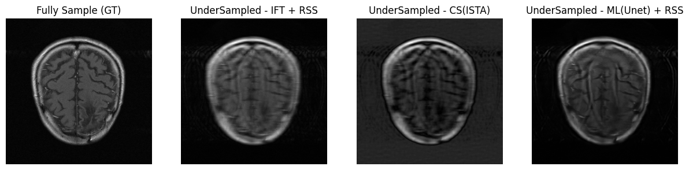

# MRI Task

## 0. Environment setting
```bash
# pull image
docker run --runtime nvidia --rm -it royinx/mri

# or build it yourself
docker build -t mri .
docker run --runtime nvidia --rm -it mri
```

## 1. MRI EDA


FastMRI format data have three columns:

1. **ismrmrd_header**: xml in ISMRMRD format with file metadata
2. **kspace**:  kspace in complex array(complex64/128) 
				with dimensions: (number of slices, number of coils, kspace_x, k_space_y)
3. **reconstruction_rss**: The root sum of squares reconstruction of the multi-coil k-space
data.


There are 4 channels `(16, 4, 640, 322)` in `file_brain_AXT1POST_207_2070829.h5` kspace data
which represent (number of slices, number of coils, kspace_x, k_space_y) respectively


While there are some hidden channels that can be found in `ISMRMRD header`


Channel <br/>(In order)  | Represent  | Value(e.g)
:--------:|:---------------:|:---------------:
nreps     | repetition      | 1
ncontrasts| contrasts       | 1
nslices   | number of slices| 16
ncoils    | number of coils | 8
eNz       | z - axis (3D)   | 1
eNy       | y - axis        | 320
eNx       | x - axis        | 640

---

## 2. Image Enhancement 
>One way to speed up the MRI, is to undersample the k-space. Less data acquisition
means faster scans. However undersampling influences the quality of the reconstructed
images. 

For this part, I have used the following techniques to generate reconstructions from the
undersampled scan:  [Code](mri.ipynb)
- Standard IFT (numpy ifft)
- Compressed sensing (ista Conv2d)
- A ML model (Unet)




---
## 3. Metrics 
Several benchmarks are adopted to measure the quality of the images reconstructed. 

Metrics | Measure | value
:-:|:-:|:-:
SSIM<br/>(Performance Evaluation <br/>Averaged Structural Similarity)  | Luminance , contrast and structure similarity  | [-1,1] <br/> 1 - High structural similarity
PSNR<br/>(Peak Signal to Noise Ratio) | Peak Signal and Noise similartity | Higher Score - Higher Similarity 
NMSE<br/>(Normalized Mean Squared Error) | Mean squared error | Lower Error - Higher Similarity

---

## 4. Deployment

The model is wrapped into docker, just simply run the following code in repo root dir:

```bash
docker build -t mri .
docker run --runtime nvidia --rm -it mri
```

---

## 5. Format Transformation

Detail code in `src/read_ismrmrd.py`, it will transform `ISMRMRD h5 file` to `FastMRI` format if run directly

```bash
python3 src/read_ismrmrd.py
```

This task is to transform  `ISMRMRD (ISMRM Raw Data)` to `FastMRI` with steps:

1. read h5 file 
2. get k space and RSS
3. put `kspace`, `RSS`, `xml_header` into h5 file


By studying ISMRMRD [architecture](https://ismrmrd.readthedocs.io/en/latest/mrd_header.html), 
- `Acquisition` storing the complex64 data - `kspace`
- `kspace shape`, `recons shape`, `encoding shape`, `encoding ratio`, `slice` , `coil`, all stored in xml header
- kspace is oversampling 1-2 times across x,y axis. [ISMRMRD Encoding Reference](https://www.ncbi.nlm.nih.gov/pmc/articles/PMC4967038/#:~:text=An%20ISMRMRD%20dataset%20may%20contain,from%20which%20it%20was%20acquired.)


<!-- reference collapse  -->

<details>
<summary>
Reference
</summary>

Links: 

[hansenms/do_recon_python.py](https://github.com/hansenms/ismrmrd-paper/blob/6ac8bce40786349545e4747118b950c0ec6438b7/code/do_recon_python.py)

[ISMRMRD docs](https://ismrmrd.readthedocs.io/en/latest/index.html)

[ISMRMRD manual](https://www.ncbi.nlm.nih.gov/pmc/articles/PMC4967038/#:~:text=An%20ISMRMRD%20dataset%20may%20contain,from%20which%20it%20was%20acquired.)

Concept:


</details>